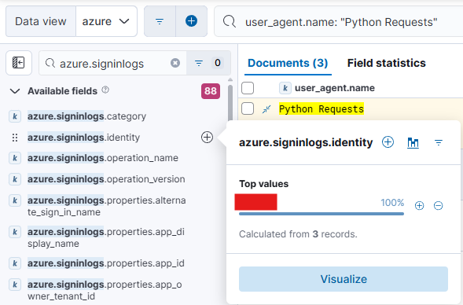
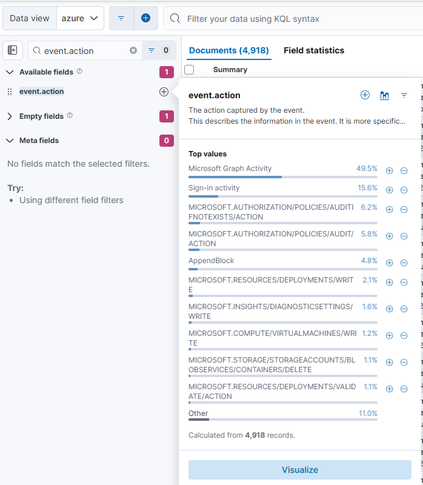
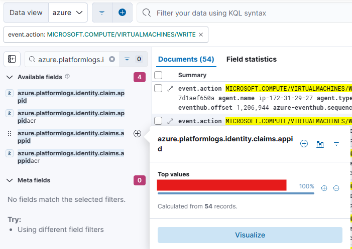
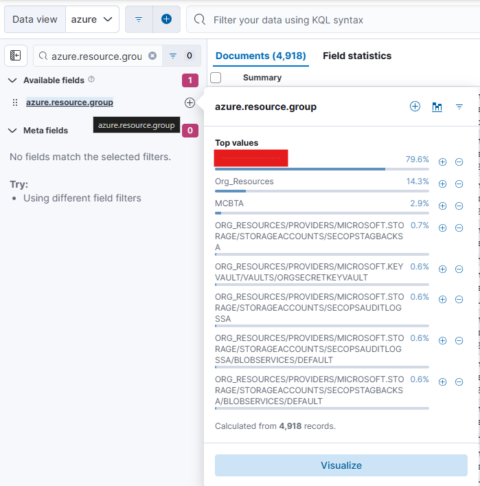
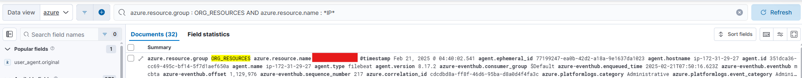
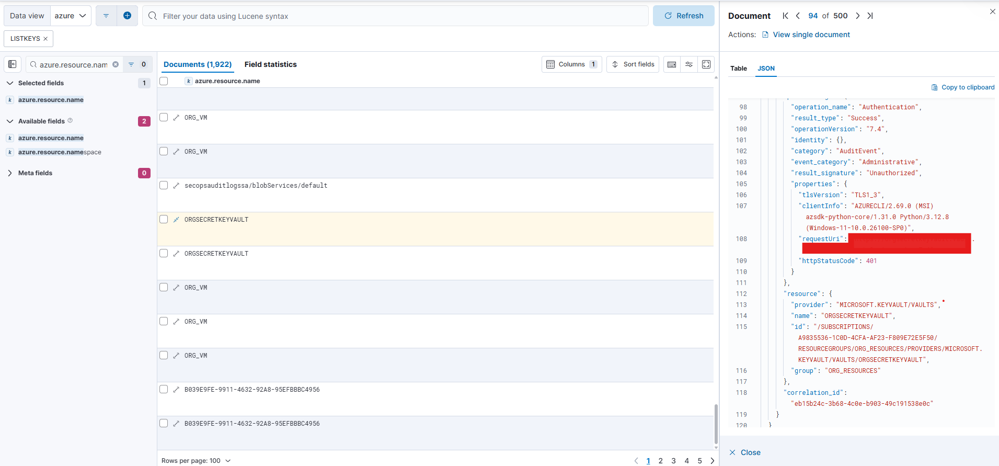
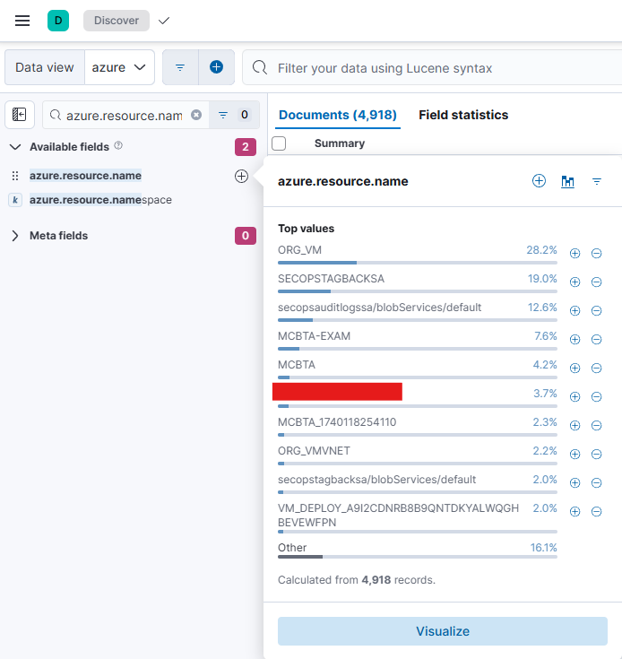
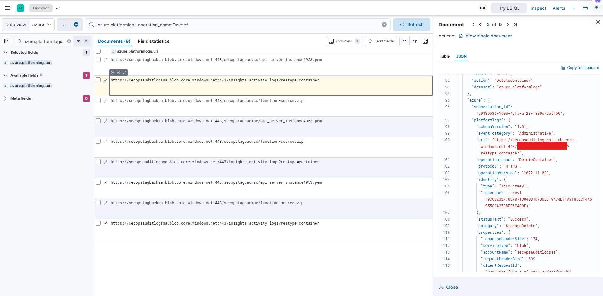

## 📘 MCBTA - Azure Investigation Report

**Analyst**: Renan - D3Z33  
**Course**: Multi-Cloud Blue Team Analyst (MCBTA)  
**Cloud**: Microsoft Azure  
**Standard References**: ISO/IEC 27001 • NIST CSF • CIS Controls • MITRE ATT&CK

---

### 🧪 Instructions

To become a certified **Multi-Cloud Blue Team Analyst**, the ultimate goal is to investigate various attack scenarios using the **SIEM: ELK Console**. The investigation involves analyzing multiple attacks targeting **AWS**, **Azure**, and **GCP** environments.

Successfully completing the module requires solving all three cloud-specific challenges outlined below:

- 🧩 All gamified, flag-based challenges come with unlimited attempts, allowing you to refine your investigation skills without restrictions.  
- ❌ There are no negative points for incorrect attempts, ensuring a risk-free learning experience.  
- ⏱️ Additionally, there are no time constraints, giving you the flexibility to analyze attack scenarios at your own pace and thoroughly investigate each challenge.

---

### 🔐 LAB ACCESS

- **USERNAME**: `***************`  
- **PASSWORD**: `***************`  
- **SIEM URL**: `****://*******************/*****`

> 🔍 Acesse e logue com suas credenciais.  
> 📂 Clique nas **três barras** ao lado superior esquerdo e vá para `Discover`.  
> ☁️ Escolha o **Data View** da prova que irá fazer, neste caso: `Azure`.

---

### ✅ Investigated Events (Q01–Q10)

> Todas as evidências foram coletadas via **Kibana** e analisadas conforme boas práticas de **análise forense em ambientes cloud**.

---

### 🔎 Q1 — Investigate and identify the Azure user which is targeted for password spraying attack

**Hint**: Focus on events linked to the user agent name “Python”.

#### 🧠 Análise
O enunciado indica um possível ataque de password spraying direcionado a um usuário do Azure. Para identificar a vítima, iniciamos a investigação buscando por tentativas de login com um user agent incomum.

#### 🔍 Procedimento realizado:

1. Acessamos o SIEM (Kibana) via `Discover`.
2. Selecionamos o data view referente ao Azure.
3. Utilizamos o campo de busca `user_agent.name: "Python"` para filtrar eventos suspeitos.
4. Refinamos a busca incluindo `azure.signinlogs` como fileset relevante.
5. Identificamos uma série de tentativas de login com o user agent Python – um indicativo típico de automação.

#### ✅ Resultado
Através da análise, descobrimos o alvo do ataque de password spraying. A imagem a seguir mostra os eventos filtrados:

[](https://github.com/D3Z33/MCBTA-Azure/blob/master/img/q1.png)

> Esse comportamento automatizado é um forte indício de ataque, sendo essencial correlacionar tentativas e origem IP para futuras ações de defesa.

---

### 🔎 Q2 — Determine the identity.claims.appid which is associated with Virtual Machine Create operation

**Hint**: Hunt for `azure.platformlogs.identity.claims.appid` associated with `VIRTUALMACHINES/WRITE` event action.

#### 🧠 Análise
O objetivo dessa questão é identificar qual aplicação (representada pelo `appid`) foi responsável por acionar a criação de uma máquina virtual (VM) na infraestrutura Azure.

#### 🔍 Procedimento realizado:

1. Acessamos o SIEM (Kibana) via `Discover`.
2. Selecionamos o data view referente ao Azure.
3. Filtramos pela ação do evento:  
   ```
   event.action: "MICROSOFT.COMPUTE/VIRTUALMACHINES/WRITE"
   ```
4. Em seguida, extraímos o campo:  
   ```
   azure.platformlogs.identity.claims.appid
   ```
5. Com isso, identificamos qual aplicação realizou a operação de criação da VM — essencial para rastreamento de ações automatizadas ou serviços comprometidos.

#### ✅ Resultado
A imagem abaixo mostra claramente o `appid` vinculado à operação de criação da máquina virtual:

[](https://github.com/D3Z33/MCBTA-Azure/blob/master/img/q2.1.png)  
[](https://github.com/D3Z33/MCBTA-Azure/blob/master/img/q2.2.png)

> Monitorar ações como `VIRTUALMACHINES/WRITE` é fundamental para detectar movimentações laterais ou persistência em ambientes cloud, especialmente quando realizadas por service principals.

---

### 🔎 Q3 — Retrieve the resource group associated with the virtual machine deployment event

**Hint**: By reviewing the `azure.resource.group` we get to identify the Resource Group associated with virtual machine deployment event.

#### 🧠 Análise
O objetivo aqui é descobrir em qual resource group foi realizada a criação de uma máquina virtual, uma informação fundamental para contextualizar o escopo de impacto de uma atividade suspeita.

#### 🔍 Procedimento realizado:

1. No `Discover`, selecionamos o índice Azure.
2. Buscamos por eventos associados à criação de máquinas virtuais.
3. Em seguida, filtramos e expandimos o campo:
   ```
   azure.resource.group
   ```
4. Com isso, obtivemos o nome do grupo de recursos onde o provisionamento foi feito.

#### ✅ Resultado
A imagem a seguir mostra o resource group associado ao evento de criação da VM:

[](https://github.com/D3Z33/MCBTA-Azure/blob/master/img/q3.png)

> Saber o grupo de recursos afetado é essencial para priorizar respostas em incidentes e identificar dependências críticas.

---

### 🔎 Q4 — Identify the Public IP entity name associated with the public IP creation for the VM

**Hint**: Hunt for `azure.resource.group` to identify the Public IP entity name with public IP creation event.

#### 🧠 Análise
O foco aqui é determinar qual recurso de IP público foi criado durante o provisionamento da VM — elemento sensível que pode expor a infraestrutura ao acesso externo.

#### 🔍 Procedimento realizado:

1. Acessamos o `Discover` e aplicamos o filtro:
   ```
   azure.resource.group: "ORG_RESOURCES" AND azure.resource.name: *IP*
   ```
2. Identificamos os logs referentes à criação de IPs públicos.
3. Extraímos o valor do campo `azure.resource.name` vinculado à operação.

#### ✅ Resultado
A imagem abaixo mostra o nome da entidade de IP público associada:

[](https://github.com/D3Z33/MCBTA-Azure/blob/master/img/q4.png)

> Criar IPs públicos sem controle é uma prática arriscada; monitorar esses eventos é crucial para prevenir exposição desnecessária de serviços.

---

### 🔎 Q5 — Determine the URI which is associated with Azure Key Vault exfiltration

**Hint**: Hunt for `azure.resource.name` to determine the resource associated with `LISTKEYS` request activity.

#### 🧠 Análise
Essa etapa visa detectar possíveis atividades de exfiltração do Azure Key Vault, especialmente por meio da operação `ListKeys`, que pode expor materiais criptográficos sensíveis.

#### 🔍 Procedimento realizado:

1. Acessamos o `Discover` com foco em eventos `VaultGet` e `ListKeys`.
2. Aplicamos filtros progressivos para refinar a análise:
   - `azure.resource.name: "ORGSECRETKEYVAULT"`
   - `event.action: "VaultGet"` ou operações similares
3. Navegamos até o campo:
   ```
   azure.platformlogs.properties.requestUri
   ```
   para extrair a URI exata da operação de exfiltração.

#### ✅ Resultado
A imagem abaixo mostra a URI utilizada na exfiltração via Key Vault:

[](https://github.com/D3Z33/MCBTA-Azure/blob/master/img/q5.png)

> Atividades de `ListKeys` exigem monitoramento contínuo — podem indicar acesso não autorizado a chaves criptográficas sensíveis.

---

### 🔎 Q6 — Unusual LISTKEYS request activity detected—identify the associated resource names

**Hint**: Hunt for `azure.resource.name` to determine the resource associated with `LISTKEYS` request activity.

#### 🧠 Análise
A ação `LISTKEYS` permite a visualização das chaves de acesso de serviços como Key Vaults, sendo altamente sensível. Identificar quais recursos foram alvos dessa ação é fundamental para avaliar possíveis riscos de exfiltração.

#### 🔍 Procedimento realizado:

1. Acessamos o Kibana e navegamos até `Discover`.
2. Selecionamos o data view da Azure.
3. No painel de filtros à esquerda, buscamos por:  
   ```
   azure.resource.name
   ```
4. Identificamos que a ação `LISTKEYS` foi associada ao recurso `ORGSECRETKEYVAULT`, relacionado ao serviço Azure Key Vault.

#### ✅ Resultado
A imagem a seguir destaca o recurso envolvido na requisição `LISTKEYS`:

[](https://github.com/D3Z33/MCBTA-Azure/blob/master/img/q6.png)

> Operações `LISTKEYS` devem ser rigorosamente monitoradas, uma vez que representam pontos de entrada para comprometimento de segredos e credenciais.

---

### 🔎 Q7 — Suspicious AZ storage container deletion activity identified, determine the blob name which gets associated over it

**Hint**: Review the log associated with `azure.platformlogs.uri`.

#### 🧠 Análise
A exclusão de containers no Azure Storage pode significar uma tentativa de ofuscação de rastros ou destruição de evidências. Para identificar qual blob foi impactado, analisamos os URIs dos eventos de deleção.

#### 🔍 Procedimento realizado:

1. No Kibana, aplicamos o filtro no campo:  
   ```
   azure.platformlogs.operation_name:Delete*
   ```
2. Localizamos o evento:  
   ```
   DeleteContainer
   ```
3. Dentro do evento expandido, inspecionamos o campo `azure.platformlogs.uri`, que indicava:  
   ```
   https://secopsauditlogssa.blob.core.windows.net:443/insights-activity-logs?restype=container
   ```
4. Esta URI aponta para o blob `insights-activity-logs`, indicando que esse foi o alvo da exclusão.

#### ✅ Resultado
A imagem mostra o evento de deleção com o blob de destino claramente especificado:

[](https://github.com/D3Z33/MCBTA-Azure/blob/master/img/q7.png)

> A exclusão desse blob pode indicar uma tentativa de encobrir atividades anteriores, sendo recomendada investigação imediata e auditoria de permissões nesse storage account.

---

### 🔎 Q8 — Investigate the Blob deletion activity and determine the objects which are deleted

**Hint**: Hunt for `DeleteBlob` event and review `azure.platformlogs.uri` to identify deleted blobs.

#### 🧠 Análise
Ao investigar os logs relacionados à exclusão de blobs, encontramos múltiplas chamadas do tipo `DeleteBlob`. Os objetos excluídos são visíveis diretamente nas URIs.

#### ✅ Resultado
Blobs deletados identificados:
- `api_server_instance4953.pem`
- `function-source.zip`

---

### 🔎 Q9 — Determine the “Principal ID” associated with the diagnostic setting the attacker deletes to stop Logging

**Hint**: Prioritize the `Principal ID` field associated with `DIAGNOSTICSETTINGS/DELETE`.

#### 🧠 Análise
Foi detectado um evento `MICROSOFT.INSIGHTS/DIAGNOSTICSETTINGS/DELETE`. Ao expandir o log, o campo `principalId` revela quem executou essa operação crítica.

#### ✅ Resultado
`Principal ID`: `ef0a2f099a5244ef8f028422fd53db99`

---

### 🔎 Q10 — Identify which diagnostic setting entity has been deleted in Azure

**Hint**: Hunt for `entity` over `azure.activitylogs.properties` associated with `DIAGNOSTICSETTINGS/DELETE`.

#### 🧠 Análise
No mesmo log da questão anterior, encontramos o nome da configuração de diagnóstico excluída no campo `entity`.

#### ✅ Resultado
`Diagnostic Setting`: `AuditLogs`

---

Perfeito! Aqui está uma sugestão de **Conclusão** final para o `azure.md`, mantendo o tom técnico, estruturado e profissional conforme ISO 27001, NIST e CIS, com um toque de encerramento digno do nosso trabalho:

---

## 🧾 Conclusão

A investigação conduzida neste módulo da certificação **MCBTA - Multi-Cloud Blue Team Analyst** abordou 10 eventos relacionados a segurança na nuvem Azure, simulando cenários reais de ataque. Utilizando o SIEM baseado em ELK Stack, aplicamos técnicas de Threat Hunting, análise de logs e correlação de eventos para identificar:

- Tentativas automatizadas de ataque como Password Spraying;
- Atividades maliciosas relacionadas à criação e exfiltração de recursos;
- Exclusão de containers e blobs sensíveis;
- Ações de evasão com remoção de configurações de diagnóstico.

Todas as ações foram documentadas seguindo rigorosamente os padrões **ISO/IEC 27001**, **NIST CSF**, **CIS Controls** e **MITRE ATT&CK**, garantindo rastreabilidade, clareza e alinhamento com boas práticas do mercado.

A conclusão deste relatório reforça a importância da **visibilidade, monitoramento contínuo e resposta a incidentes em ambientes multi-cloud**, demonstrando a capacidade do analista em atuar com precisão frente a cenários complexos.

---
